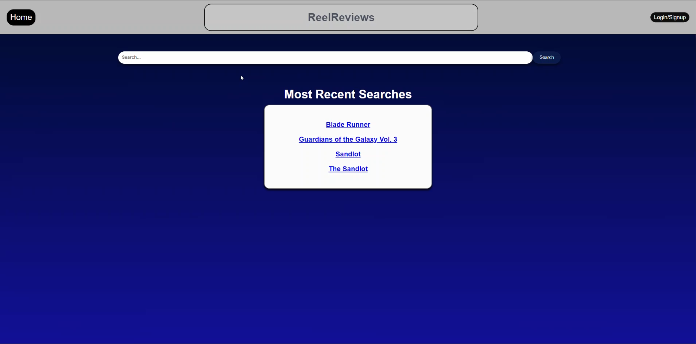

# ReelReviews

## Table of Contents

* [Introduction](#introduction)
* [Description](#description)
* [Technology](#technology)
* [Installation](#installation)
* [Models](#Models)
* [Usage](#usage)
* [Contribution](#contribution)
* [Contact](#contact)
* [License](#license)

## Introduction
We wanted to be able to look up movie information in a clean and easy to read format to decide what to watch. Other sites have too much extra information which can be distracting.

## Description
ReelReviews is an application that allows you to look up movie information to determine if you would like to watch a specific movie! You can search for movies by their title and return the rating, runtime, genre, language and the movie poster! If you sign up for an account, or log in to your existing account, you can also leave your own review of the movie! 

## Technology
| Technology Used        | Resource URL         |
| ---------------------- | :-------------------:|
| Sequelize | [https://sequelize.org/](https://sequelize.org/) |
| MySQL2 | [https://www.npmjs.com/package/mysql2](https://www.npmjs.com/package/mysql2) |
| Express Handlebars | [https://www.npmjs.com/package/express-handlebars](https://www.npmjs.com/package/express-handlebars) |
| DotENV | [https://www.npmjs.com/package/dotenv](https://www.npmjs.com/package/dotenv) |
| Express Session | [https://www.npmjs.com/package/express-session](https://www.npmjs.com/package/express-session) |
| Animate.CSS | [https://animate.style/](https://animate.style/) |
| Connect Session Sequelize | [https://www.npmjs.com/package/connect-session-sequelize](https://www.npmjs.com/package/connect-session-sequelize) |
| OMDB API | [https://www.omdbapi.com/](https://www.omdbapi.com/) |
| Excalidraw | [https://excalidraw.com/](https://excalidraw.com/) |

## Installation
use "npm i" to install all required npm packages. Then run "npm seed" to seed the database, and finally run "npm start".

## Models

### Movie
#### Attributes
ID (primary key), Title, Rated, Released, Runtime, Director, Writer, Actors, Plot, Language, Awards, Poster
#### Validations
All Items: Cannot be null
#### Relationships
Has Many Reviews

### Review
#### Attributes
ID (Primary Key), Posting User, Review Rating, Review Content, Movie_ID (foreign key), User_ID (foreign key)
#### Validations
Review Content, Review Rating cannot be Null.
#### Relationships
Each Review belongs to one user. 
Each Review belongs to one movie. 

### User
#### Attributes
ID (Primary Key), Username, Password
#### Validations
password: minimum length of 8 characters | all: cannot be null
#### Relationships

### Search
#### Attributes
ID, MovieID
#### Validations
None
#### Relationships
None

## Usage
Watch the demo below to see how to use the site!  
  
### Application Screenshot  
 
### Application Demo 
  
### Animate.css   
  
### OMDB API Call  

## Contribution
Brett Burrington, Minhee Chung, Ryan Payne, Matthew Schneble

## Contact
You can reach out to our customer support team at:
 - Email: customersupport@reelreviews.com
 - Github: https://github.com/mattschneble/ReelReviews

## License
There is no license associated with this project. 